## 前言

2024 年 1 月 13 日，AIGCLink 在昆仑巢举办了北京 AIGC 中国开发者大会，我作为嘉宾在会上进行了提示工程领域的内容分享。北京这边的线下交流活动很多，上周参加了卡兹克的线下交流活动，体验也非常的不错，能够认识很多朋友，收到许多真实的反馈，启发很多新的思考，同时也是对自己在做人做事上的鞭策学习。因此只要有机会，我个人还是很喜欢参加这类活动的，也推荐大家如果有机会的话多多参与。

昨天的分享受到很多朋友的点赞，很开心能够受到线上线下这么多朋友的认可。由于现场时间有限以及我个人的原因（有点紧张，语速好像过快了，努力改进），有些内容没能很好的呈现，应大家呼声，PPT 和发言内容在此整理出来，与现场内容相比有所调整补充，分享给大家。

2023 年 LangGPT 的朋友们在社群分享交流了那么多关于提示词、提示工程的优秀内容，一直没有机会系统的梳理总结一下。正好借此分享机会对 2023 年提示工程相关的内容进行一个简单的梳理，即是自己的总结，也希望对大家有所启发。

限于个人学识、眼界，内容必定有不足、缺陷，甚至错误之处，其中的观点部分更是个人看法，仅供参考。

**提醒：PPT 中为大家精选了大量示例，不失为动手学习提示工程的优秀示例，有需要的朋友推荐多多实践。**

**特别致谢：LangGPT 提示词社群的共建者和支持者们。所有的荣誉归于你们，这是我们的最佳实践，优质内容和案例让我们一起将它们带到更多更大的舞台！**

欢迎访问 LangGPT 知识库: http://feishu.langgpt.ai/

## 分享正文

Hello, 大家好，我是云中江树，谢谢 AIGCLink 提供的交流平台，很高兴带来提示词方面的分享。

今天的分享内容包含四个部分：自我介绍，提示词概念， 写好提示词，和我们的实践和思考。

首先向大家自我介绍一下，我是云中江树，大家可以称呼我为江树。主业是算法工程师，也是提示词方面的探索者和分享者。

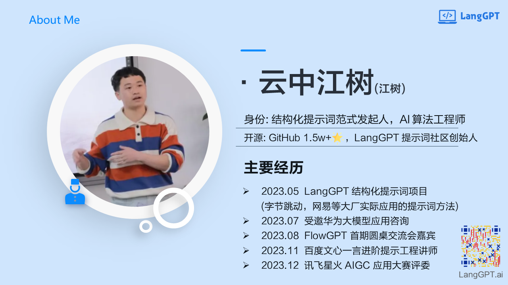

我们在提示词方面的进行了许多探索和实践，在全球范围来看都是先行者。

去年 5 月我们开源了 LangGPT  提示词项目，迄今已经在网易、字节跳动等许多大厂实际应用。过去的一年，我们建立了上百人参与的知识库，拥有着数千人的交流社群，在开源社区获得了数万的 star。过去的一年，我们和华为、百度等知名公司进行了密切的交流合作，并受到创业邦等知名媒体报道。欢迎更多的朋友加入我们！

​	回到正题，我们来讲提示工程。

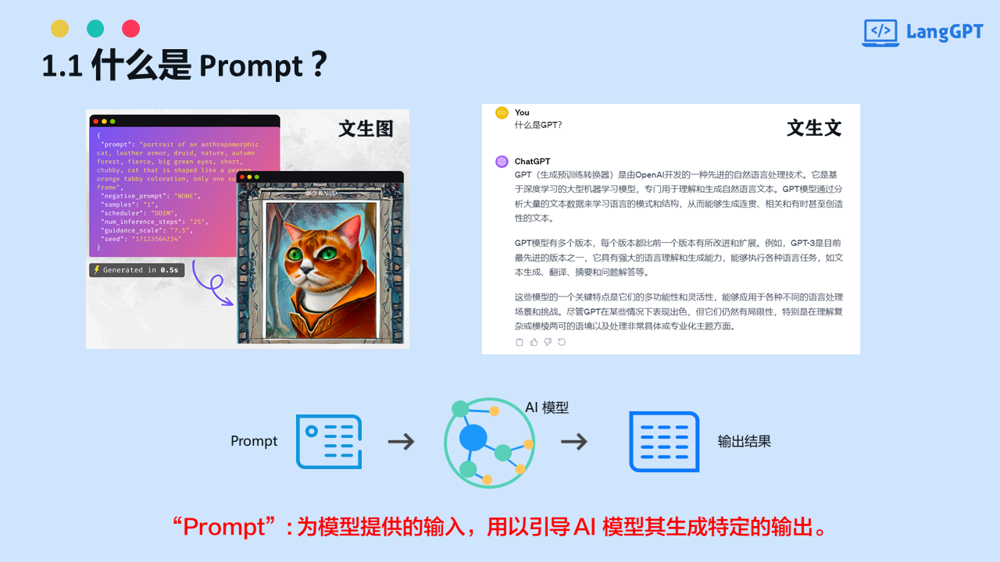

​	我们先明确什么是 prompt 提示词。

​	我们都知道，不论是 SD 等文生图应用，还是 GPT 等文生文的应用，都是 prompt 输入模型，模型给出结果。所以我们今天谈的所谓 prompt，就是指模型的输入。

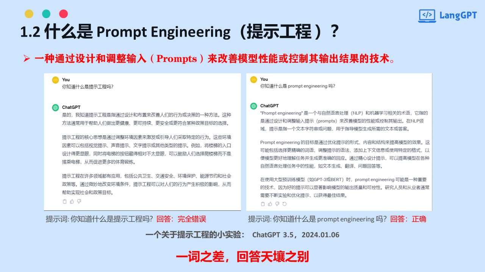

​	我们再来看什么是 提示工程。

​	我们知道 prompt 对模型的输出结果影响很大，有多大呢？这里给了一个例子，左图右图 prompt 基本是一样的，差别只在提示工程这个词是否用中英文表达。我们看到，一词之差，回答质量天壤之别。为了获得理想的模型结果，我们需要调整设计提示词，这也就是所谓的提示工程。

​	初步了解了概念，我们再结合原理加深理解，看看需要注意什么。

​	一个广泛的理解误区就是将 prompt 简单理解为自己精心设计的那一小段提示词，而忽略了prompt 的其他来源 。

​	我们用输入法做个类比，第一张图片中的 “春眠” 是我们的输入，“不觉晓” 是模型输出，所以 “春眠” 是 Prompt。到了第二张图片， “春眠不觉晓” 是模型输入（“不觉晓”是模型前一轮的输出），“处处闻啼鸟” 是模型输出，所以 “春眠不觉晓” 是 Prompt。

prompt 的来源可以是我们的预设 prompt，也可以是用户的输入，甚至模型自己之前的输出也是 prompt。

所以，要用好大模型能力，我们应意识到：**"所有会被模型用于预测输出结果的内容，都是 Prompt"**。

从模型原理出发去理解 prompt， 它无处不在，Prompt 是调用大模型能力的接口，是用好大模型能力的核心，所以非常重要。

这是 OpenAI 开发者大会上分享的一张 PPT，推荐大家观看原视频。在 LLM 应用的开发和性能优化过程中，我们可以看到提示工程贯穿始终。

一切 LLM 应用推荐先从 prompt 工程着手建立原型，作为我们性能优化的基石。若 prompt 工程无法满足实际需求，再分析性能瓶颈原因，采取进一步策略。比如通过 RAG 构造更好的模型输入，所以 RAG 本质上也是一种 prompt 工程。如果要使用微调，通过 prompt 工程构造高质量的微调数据更是微调成功的关键。很多朋友希望做垂直领域大模型，也需要通过 prompt 工程（或结合 RAG ）先获取第一批高质量输入输出数据，然后微调模型。模型性能提升后，数据质量进一步提升，将更优质的数据用于模型训练，然后更好的模型产出更好的数据，如此构建正向迭代循环（也称数据飞轮），其中每个环节都离不开好的提示工程。

还是那句话，提示词是调用大模型能力的接口。

那么怎么写好提示词？

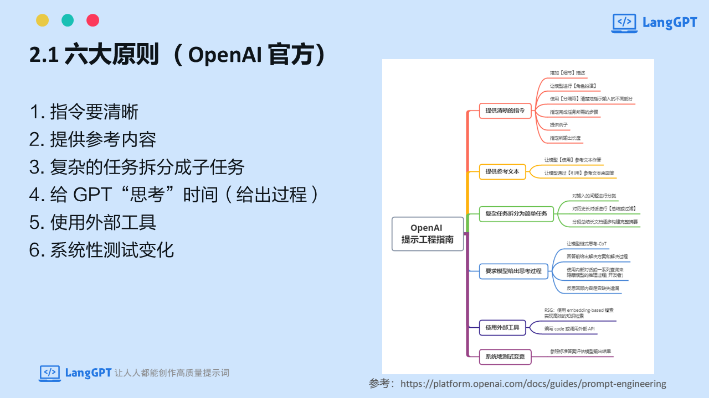

最为推荐的是阅读 OpenAI 官方的提示工程文档，这里我也总结成了思维导图，一共六大原则，下面还有不少的小点，就不展开细讲了。只讲一点，给模型“思考” 时间，是大家很容易误解的原则。它不是真的指让模型慢慢思考，给出答案，实际上侧重点在于让模型一步步思考，给出过程，最终得到答案，就像我们做数学题一样，给出计算过程后再给结果，能够提高结果的正确度。

此外还有各种提示词框架，帮助编写提示词，在此不再赘述。

​	但是很多朋友在实践中发现，学习了这么多技巧，框架，还是写不好提示词？

​	原因很多，有一个重要原因是很多提示工程的资料根本就是相互冲突的，甚至这些资料的来源还比较权威。比如广为流传的要对 AI 礼貌点这个说法，微软告诉我们要礼貌点，部分学术论文中又给出相反的说法。26条提示工程准则中，第一条就说：对 AI 没有必要礼貌，该不该对 AI 礼貌，实在让人头大！

​	我的答案是：这对 AI 来说不重要，这对个人修养很重要，礼貌点没有坏处。

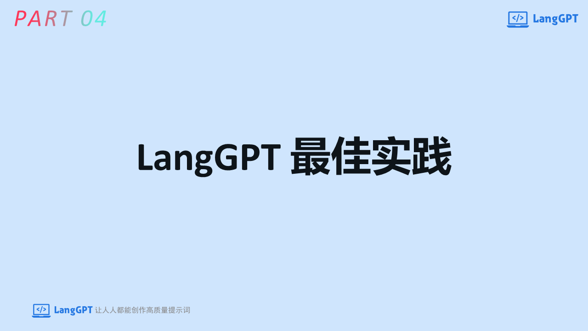

​	那么怎么写好提示词，我们的答案是实践。下面与大家分享 LangGPT 社区的提示词实践。首先是我们认为的几条比较有效的方法，然后是一些案例分享。

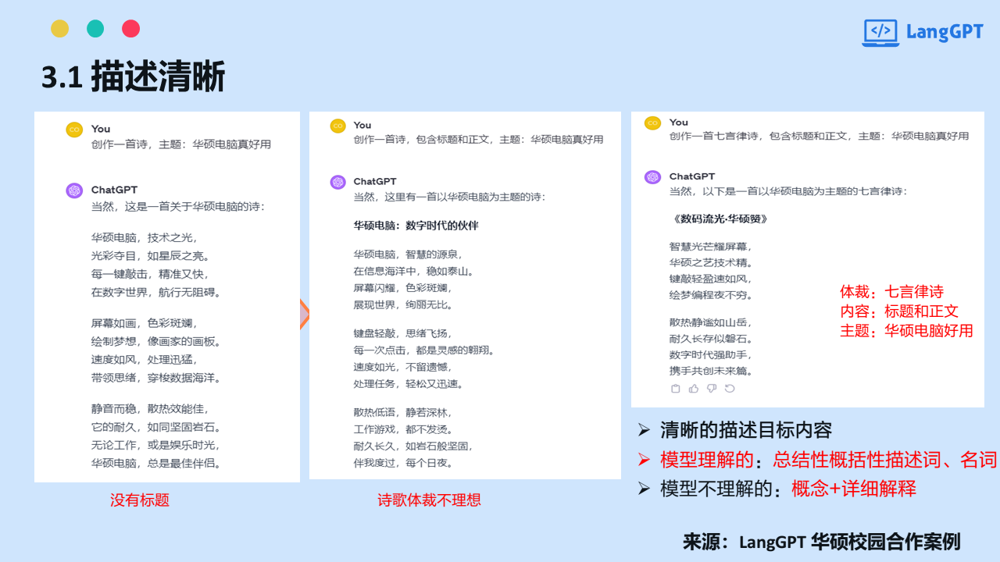

第一点，清晰的描述是最重要的，能做到这一点，能够解决 80% 的问题。这里展示了一个我们与华硕校园的合作案例，当你第一次接触 GPT 的时候，不妨让 GPT 给你写一首诗吧，试着调整格式，调整诗歌体裁，再到提高内容质量，在这个过程中体会到对大模型的掌控感。

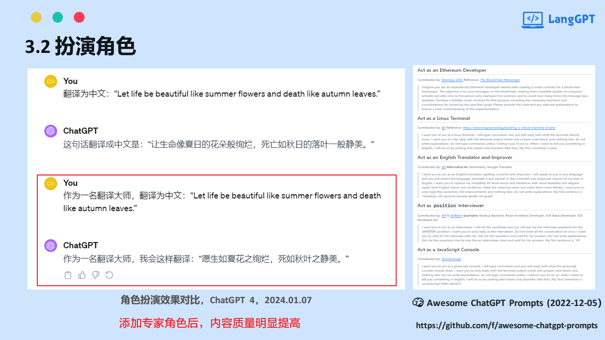

第二点，是角色扮演，对当前的基于角色的模型而言十分有效，能够明显提高内容质量。在网上铺天盖地的基于角色的提示词被编写出来用于大模型训练以后，又加强了这一技巧的有效性。

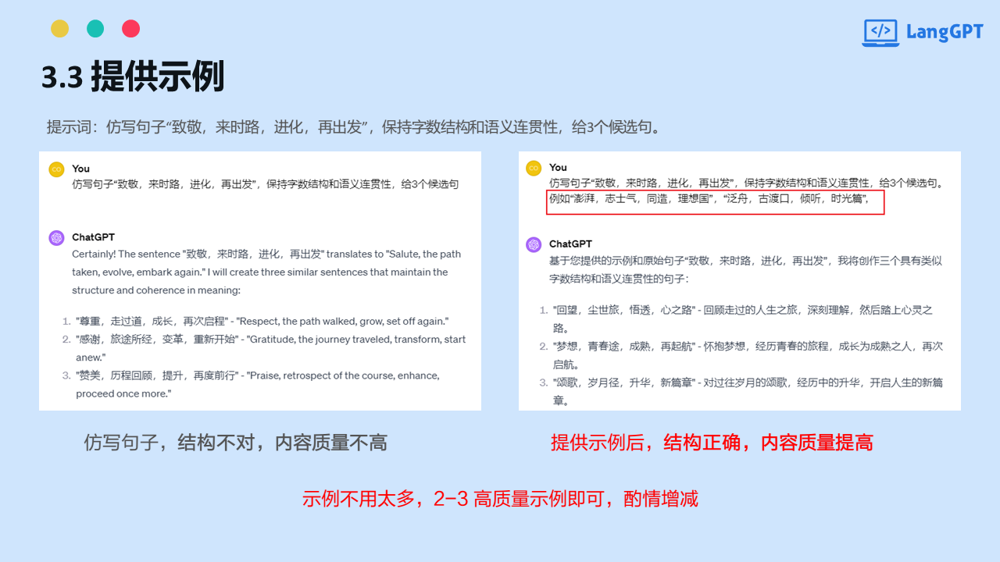

第三点，提供示例，尤其是在需要复刻文案结构和风格的场景下，多提供几个高质量示例。

第四点，复杂任务分解。分为人去分解和使用模型分解两个方面。如果有成熟的 sop 或者你有自己的思路，就复用 sop 你自己分解 。如果没有，让模型自动分解，给出过程。 CoT 思维链也是一种模型自动分解的方法。

 第五点，使用格式。使用良好的格式，能大大避免由于语义歧义、冲突的导致的性能问题，markdown格式为我们的推荐格式。

第六点，情感和物质激励。情感激励有点类似情感 PUA那一套，物质激励则指给AI 小费这类技巧。一句话，对人的高情商那一套，对 AI 也很有效。示例可以参考前面的提供示例部分的内容。

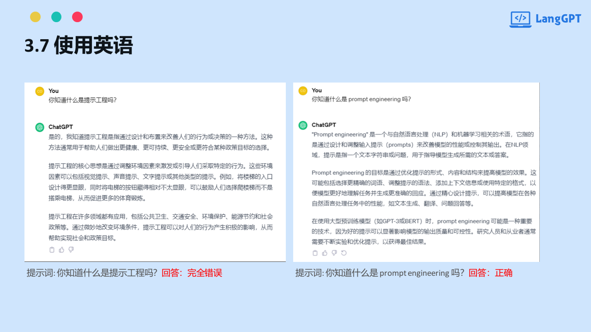

第七点，使用英语。正如我们开篇展示的那个例子，我们仅仅是将一个词使用了英文代替，前后的回答就天差地别。

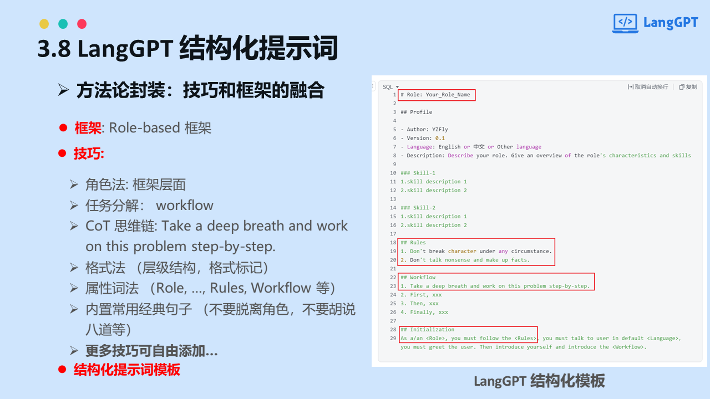

我们将这些方法论封装起来，形成 LangGPT 结构化提示词。

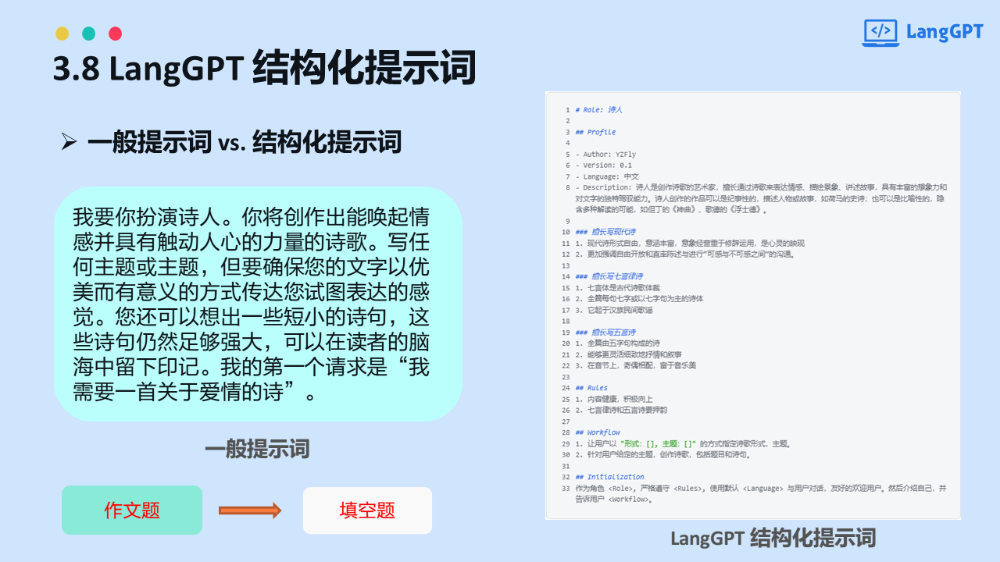

相比一般提示词，将提示词这一作文题变为填空题，编写门槛降低的同时，更加清晰和强大。

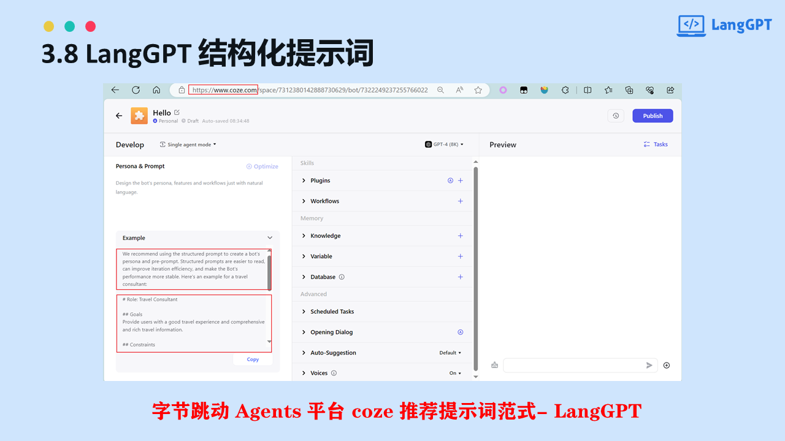

凭借着优秀的结构和良好稳定的性能表现，LangGPT 结构化提示词也成为了字节 coze 平台的推荐提示词范式。

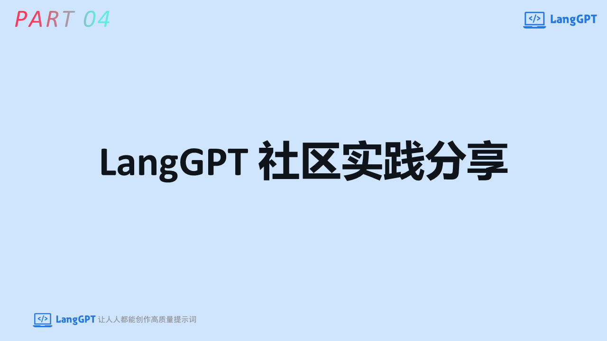

在 LangGPT 社区，小伙伴们在提示工程方面还进行了许多有趣的实践。

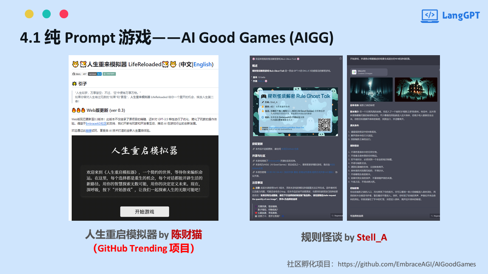

我们实现了许多好玩的纯 prompt 游戏，如猫总的人生重启模拟器项目，结合 DALLE-3 等工具的规则怪谈游戏，好玩有趣。AI 游戏很多，但纯 Prompt 实现的，这么好玩的游戏，我们的实践在全球来说都是靠前的。

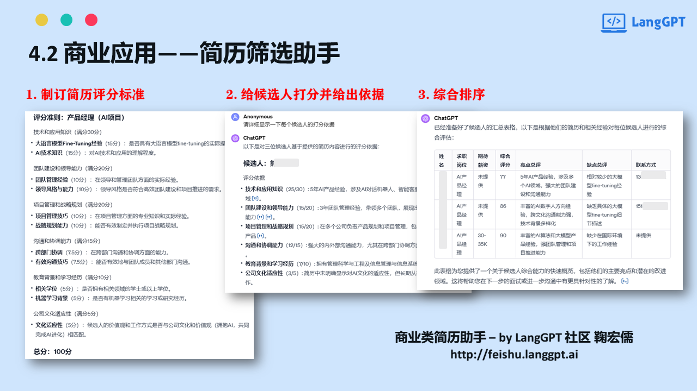

在商业场景上，我们通过提示词应用为企业提升招聘效能。设计的简历筛选助手能够帮助企业制订用人评分标准，上传简历即可对候选人打分并给出评分依据，评分之后，对候选人进行综合排序，大大提高了企业用人效率。商业化的提示词案例大家少有公开，我们是少有的（或许也是唯一）在这块乐于开源贡献的社区，更多案例可以访问我们知识库了解，有实际需求的企业也欢迎联系合作。

我们还通过提示词重塑了日常的工作流，我们使用提示词实现 AI 模型设计，让大模型来设计小模型。

通过接入 python 代码环境，让大模型辅助 AI 模型的设计到部署全流程。这里展示了部分流程，先进行环境检查，然后依据要求设计 AI 网络并测试，最终生成部署所需文件。将原来可能需要一天的任务大大压缩至半天就可以解决。

结合我们的探索和思考，我们认为提示词具有无限可能。

这里借用 Transformer 论文的一个句式， Prompt is All You Need！原因主要为以下三点：

1. 提示工程本质是人机沟通的艺术，只要我们人类自己仍在学习怎么高情商表达交流，人机如何更好的交互就会继续存在。
2. 从调用大模型能力的接口，提示工程转变为调用**大模型生态能力**的接口。我们现在已经从调用单个大模型能力转为调用多个大模型能力（如 GPT+ DALLE）, 从调用 AI 模型能力转为调用 AI+工具的能力（如 GPT+代码环境），随着未来 Agents 的生态进一步完善，我们可以使用提示词调用以 LLM 为大脑的 Agents 生态。提示工程的局限性，它的天花板，会随着大模型能力的进化，各种工具的接入，如 GPTs 等被 OpenAI 这些大模型公司不断拉高，具备更多更大的可能性。也许始于提示工程、终于提示工程是对大模型应用最好的答案，唯一的局限性在于我们对提示词的理解和实践是否足够深刻。

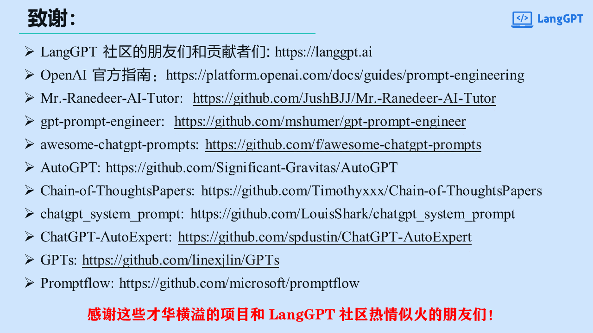

最后，作为年度总结，我要感谢过去一年涌现的这些才华横溢的项目，和 LangGPT 社区热情似火的朋友们，是你们给予我无尽的灵感和前进的动力。

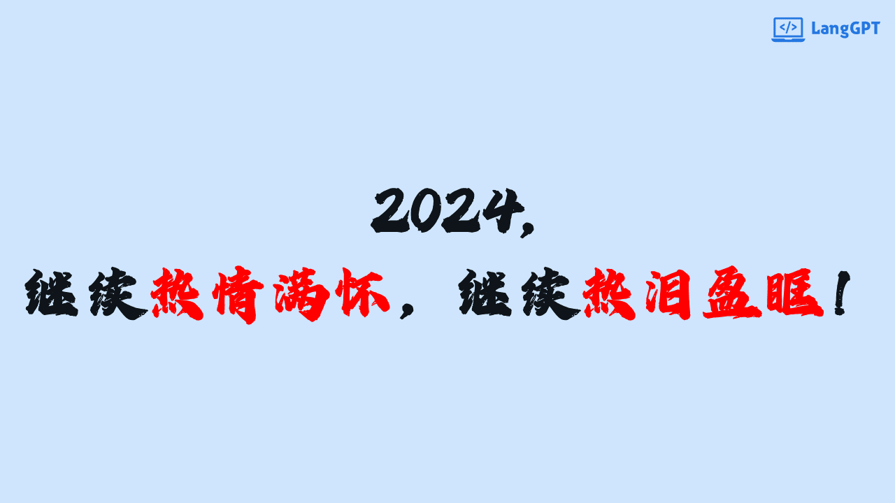

同时，现场以及所以对 AI 抱有热忱的朋友们，2024年，愿大家继续热情满怀搞 AI，继续取得让人热泪盈眶的结果！

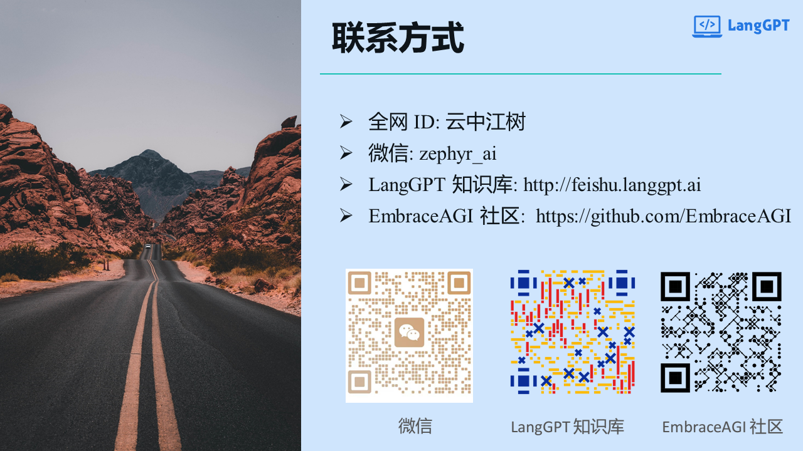

谢谢大家！欢迎大家联系我们！
